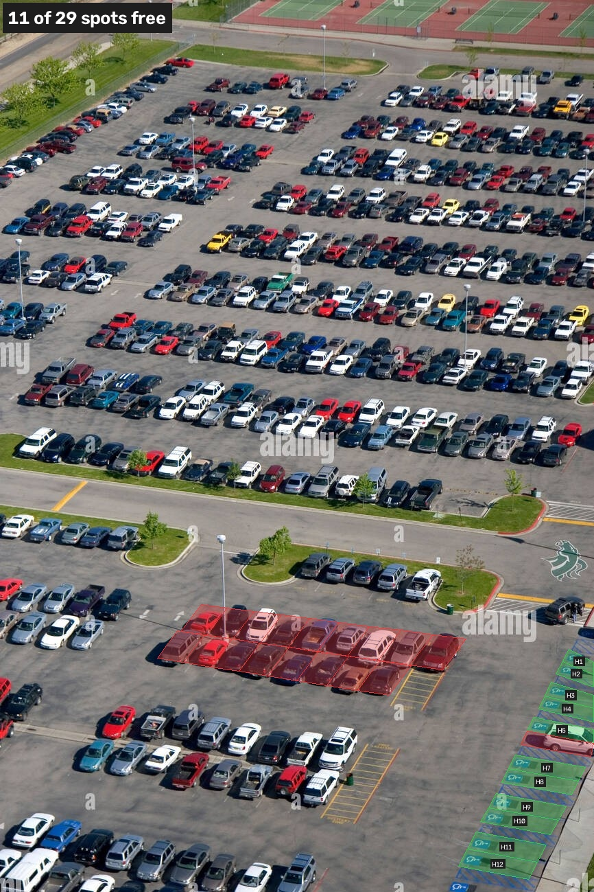

# parking-lot

Finds open parking spots from a camera. You mark where the spots are once, then YOLO detects the cars and any spot without a car in it counts as free.



## setup

```
python -m venv .venv
.venv\Scripts\activate
pip install -r requirements.txt
```

## usage

First mark the spots. The source can be an image, a video, a webcam number (`0`) or an rtsp url.

```
python mark_spots.py --source test/parkinglotexample.jpg --spots spots/parkinglotexample.json
```

Click the 4 corners of a row, type how many spots are in it and press enter. It splits the row up for you. Right click deletes a spot, u is undo, s saves, q quits.

Then run it:

```
python find_spaces.py --source test/parkinglotexample.jpg --spots spots/parkinglotexample.json --tile 224 --imgsz 896 --save output/result.jpg
```

or on a webcam:

```
python find_spaces.py --source 0 --spots spots/mycam.json --show --stride 30
```

`--tile` is only needed when the cars are really small like in the test photo. It's slow without a GPU (around 40s for that image). `--json status.json` writes whether each spot is free to a file. Run with `--help` for the other options.

## notes

- if YOLO misses a car, that spot shows as free, so the camera angle matters a lot. the closer the better
- the far rows in the test photo don't get detected well, that's why only the close ones are mapped
- if the camera moves you have to redo the spots
